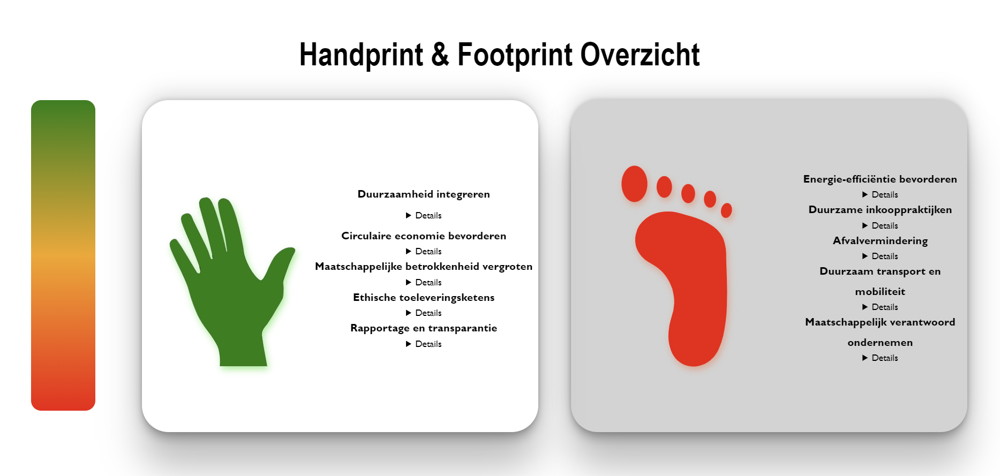

> _Fork_ deze leertaak en ga aan de slag. Onderstaande outline ga je gedurende deze taak in jouw eigen GitHub omgeving uitwerken. De instructie vind je, zoals altijd, in: [docs/INSTRUCTIONS.md](docs/INSTRUCTIONS.md)

# Titel
Hand- en Footprint overview - Crossmarx.

## Inhoudsopgave

  * [Beschrijving](#beschrijving)
  * [Kenmerken](#kenmerken)
  * [Bronnen](#bronnen)
  * [Licentie](#licentie)

## Beschrijving
<!-- In de Beschrijving staat hoe je project er uit ziet, hoe het werkt en wat je er mee kan. -->

🌐 https://smolgeorgie.github.io/the-client-website 

## Kenmerken
<!-- Bij Kenmerken staat welke technieken zijn gebruikt en hoe. Wat is de HTML structuur? Wat zijn de belangrijkste dingen in CSS? Wat is er met Javascript gedaan en hoe? Misschien heb je een framwork of library gebruikt? -->

## Licentie

This project is licensed under the terms of the [MIT license](./LICENSE).
