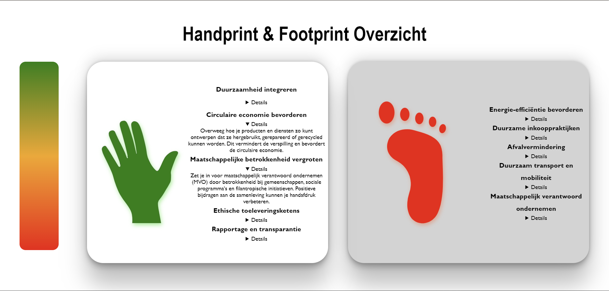

> _Fork_ deze leertaak en ga aan de slag. Onderstaande outline ga je gedurende deze taak in jouw eigen GitHub omgeving uitwerken. De instructie vind je, zoals altijd, in: [docs/INSTRUCTIONS.md](docs/INSTRUCTIONS.md)

# Hand- en Footprint overview - Crossmarx.

## Inhoudsopgave

  * [Beschrijving](#beschrijving)
  * [Kenmerken](#kenmerken)
  * [Bronnen](#bronnen)
  * [Licentie](#licentie)

## Beschrijving
De hand- en footprint overview is een tool waarbij er een overzicht wordt gecreëerd van een bedrijf zijn/of haar foot en hand print. De kleuren zijn indicatoren of het goed of slecht is en of het verbeterd kan worden door middel van tips en tricks. 

🌐 https://smolgeorgie.github.io/the-client-website 

## Kenmerken
Dit project is gemaakt in HTML en CSS. Daarbij heb ik verschillende soorten elementen erin verwerkt wat het overzichtelijk maakt. Daarvan is er [SVG](#svg) element gebruikt voor snelle laadtijd en een [Details](#details-element) element zodat er veel tekst in een kleine ruimte kan passen. 

### SVG 
https://github.com/smolgeorgie/the-client-website/blob/766fe60506bb8eb4f12c7efae779bbd30d910c41/index.html#L34-L43

### Details element
https://github.com/smolgeorgie/the-client-website/blob/766fe60506bb8eb4f12c7efae779bbd30d910c41/index.html#L48-L55

## Licentie

This project is licensed under the terms of the [MIT license](./LICENSE).
